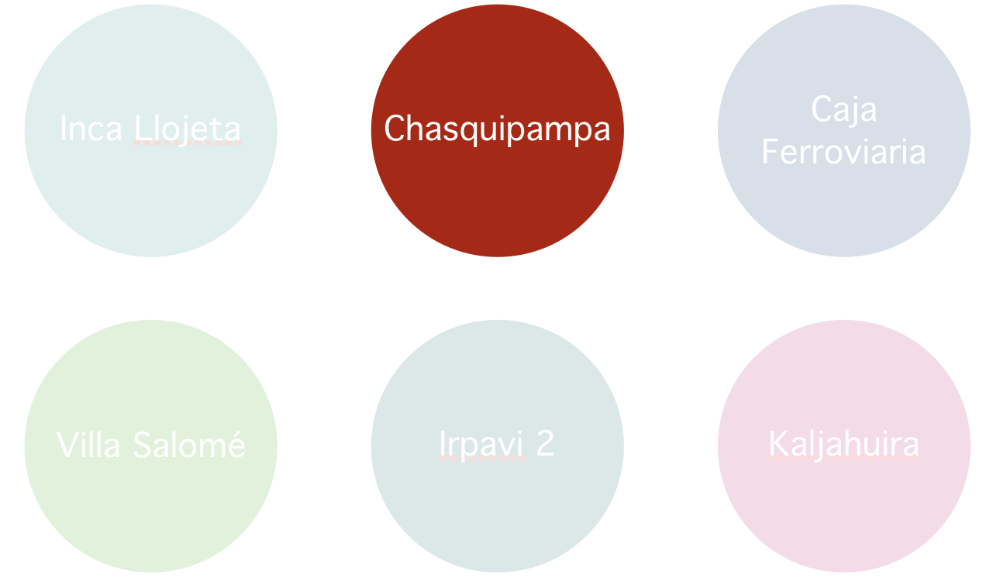
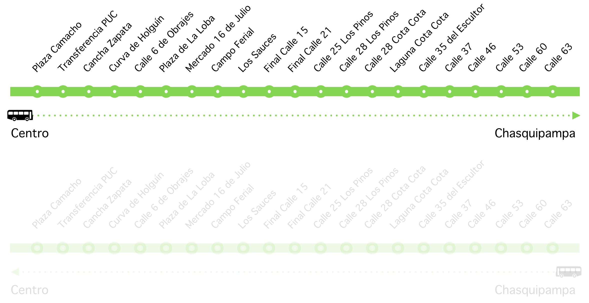
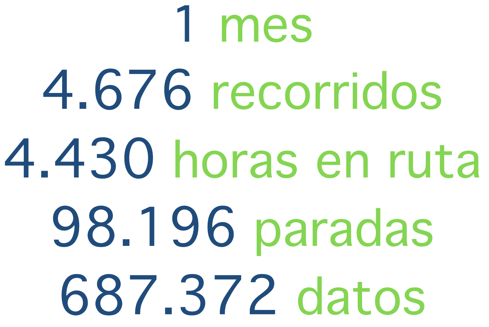
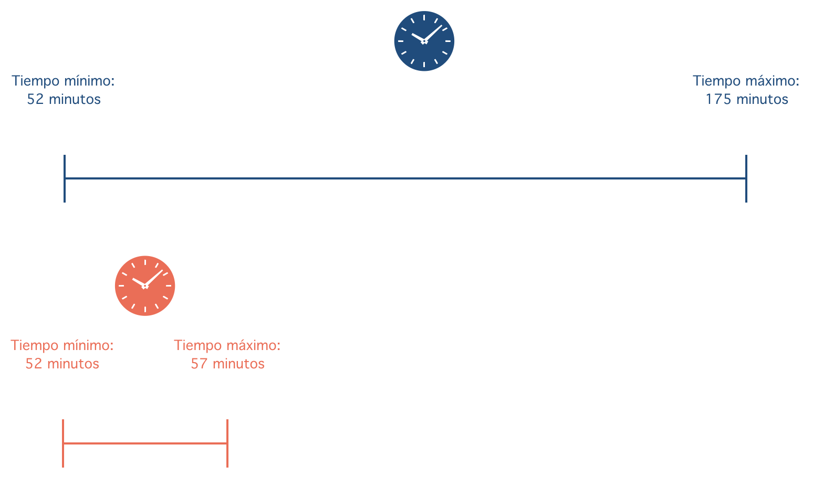

```{r, echo=F, warning=FALSE, error=FALSE, include=FALSE}
source("pumas.stats.R")
```

## {data-background=#CBF6FF}  
<h6>Puma Kataris & Big Data</h6>

<br>
<small><h6>Rafael López V.</h6></small>

##
<h6>Antecedentes: 1er sistema de transporte urbano masivo en Bolivia</h6>
<br>


<br>
<small><small>Ver mas en: [lapazbus.bo](http://www.lapazbus.bo) </small></small>

## {data-background=#CBF6FF}  
<br>
<br>

<h2><center>Objetivos: 

Mostrar que conectando los buses al Big Data el servicio puede ser monitoreado, segundo a segundo, y mejorado para el bien de la gente y del municipio</center></h2>

## {data-background=#CBF6FF}  
<h2><center>Para lograr el objetivo: 

<br>
Se han simulado casi 700 mil datos sobre el recorrido de los buses 

La simulación trata de acercarse a la realidad lo más posible


## {data-background=#CBF6FF}  
<br>
<br>
<br>
<br>
<h2><center>Alcances de la simulación</center></h2>

## Se eligió 1 de las 6 rutas
<br>
<br>


## Se eligió una dirección de la ruta
<br>
<br>


## 
<h4>Se tomaron los tiempos 5 veces en horas que se suponen normales (sin tráfico, protestas, etc)</h4>
<br>


## 
<h3>Se introdujeron alteraciones predecibles a la normalidad</h3>

<br>

<h3>- Paradas con más gente que otras

- Tramos mas lentos que otros: tráfico vehicular

- Marchas y bloqueos en el centro de la ciudad 

- Horas que afectan los tiempos en los tramos (v.g. medio día vs. media noche)</h3>

## 
<h4>Se supuso que los buses al pasar por las paradas generan automáticamente los datos<h4>


## 
<br>
<br>
<br>
<br>
<center><h2>Se computaron los intervalos [oficiales](http://www.lapazbus.bo/horarios/3/) de partida y con todo  lo anterior se simularon casi 700 mil datos en [R](https://www.r-project.org)</center></h2>


##
<h4>Muestra de la simulación en R</h4>
<iframe width="1200" height="650" src="https://www.youtube.com/embed/iAGTwDc71rk?rel=0&amp;controls=0&amp;showinfo=0;autoplay=1" frameborder="0" allowfullscreen></iframe>

##{data-background=#CBF6FF}  
<br>
<br>
<br>
<br>
<center><h2>Resultados de la simulación</center></h2>

##
<br>
<br>


##{data-background=#CBF6FF}
<br>
<br>
<br>
<br>
<center><h2>Estadísticas: Sugiero que imagine que así se podrá monitorear el servicio</center></h2>

## 
```{r, echo=FALSE}
b
```
<br>
<left><small> - 97% de los viajes  tardan entre 52 y 60 minutos desde la primera hasta la última parada </small></left>
<br>
<left><small> - Sin embargo, a veces los buses tardan hasta 175 minutos (casi 3 horas)</small></left>
<br>
<left><small> - Veamos qué días y a qué horas se producen los mayores atrasos</small></left>

## 
```{r, echo=FALSE, include=TRUE}
d
```
<br>
<left><small> - Los 4 picos muestran atrasos por protestas sociales  </small></left>
<br>
<left><small> - ¿En qué tramos están las protestas?</small></left>

##
```{r, echo=FALSE, include=TRUE}
f
```
<br>
<left><small> - Los tramos entre las paradas 1 y 4 son los menos regulares. Los mayores  atrasos se generan allí</small></left>
<br>
<left><small> - Veamos en detalle estos tramos, sabiendo que son los que generan los atrasos</small></left>
<br>

##
<br>
<br>
<br>
<br>
<center><h2>Para ver el atraso por tramos y horas se utilizaron "boxplots". Ver la siguiente explicación </center></h2>


##


##
```{r, echo=FALSE, include=TRUE}
h
```
<br>

<left><small>Veamos el mismo gráfico pero sin valores extremos</small></left>

##
```{r, echo=FALSE, include=TRUE, fig.height=1200}
i
```

## {data-background=#CBF6FF}
<br>
<center><h3>Hasta aquí: 

Las protestas sociales en 4 días del mes produjeron los atrasos mas considerables

Las protestas ocurren en el centro y perjudican a las paradas 1, 2 y 3 

Las protestas afectan a los buses que transitan entre las 11am y 5pm</center></h3>

## {data-background=#CBF6FF}
<br>
<br>
<br>
<center><h2>¿Los atrasos se dan únicamente por protestas sociales?
<br>
<br>
Veamos los tiempos  de recorrido excluyendo los días de las protestas</center></h2>

## 
```{r, echo=FALSE, include=TRUE, fig.height=1200}
noconf
```
<br>
<center><h6>En días "calmados" el tiempo más rápido del Puma Katari es de 51 minutos pero el mas lento de 64 minutos</center></h6>

## {data-background=#CBF6FF}
<br>
<br>
<br>
<br>
<center><h2>¿Qué tramos podrían corregirse y a qué horas para que los buses sean mas predecibles?</center></h2>

##
```{r, echo=FALSE, include=TRUE}
tramos.noconf
```
<br>
<h6>Los tramos 1-2 y 3-4 son los que tienen mayor variación
<br>
Antes cerciorémonos que los otros tramos no tienen variaciones extremas</h6>

## 
```{r, echo=FALSE, include=TRUE}
tramos.noconf1
```

<small>La mayoría de los buses en estos tramos tienen variaciones de tiempo de menos de un minuto. Los problemas mas serios no están en estos tramos</small>

## {data-background=#CBF6FF}
<br>
<br>
<br>
<br>
<center><h2>Se sabe que los tramos 1-2 y 3-4 son los que generan los mayores atrasos. Pero, ¿a qué horas?</h2>

##
```{r, echo=FALSE, include=TRUE}
tramos.noconf2
```
<left><small>Los mayores problemas están a horas 7,8,9,13,14,19 y 20</small></left>

##
```{r, echo=FALSE, include=TRUE}
tramos.noconf3
```
<left><small>Las distorsiones de tiempo están claramente a las 7 y 8 de la mañana</small></left>

## {data-background=#CBF6FF}
<br>
<br>
<br>
<br>
<center><h2>¿Es posible que los atrasos se originan por la tardanza de los pasajeron al subir al bus en horas y paradas pico?</center></h2>

## 
```{r, echo=FALSE, include=TRUE}
pasajeros
```
Los pasajeron no contribuyen significativamente al atraso. En promedio un bus necesita 18.01 segundos 
para subir a los pasajeros

## {data-background=#CBF6FF}
<br>
<br>
<br>
<br>
<center><h2>Resumen hasta aquí</center></h2>

##
<br>
<br>
<center><h4>Problema 1: protestas sociales</center></h4>
<br>
<h1>**77 días**</h1>
<center><h4>Es la suma del tiempo perdido de los pasajeros en los 4 días de protestas</center></h4>
<br>

##
<br>
<br>
<center><h4>Problema 2: tramos y horas pico</center></h4>
<br>
<h1>**155 días**</h1>
<br>
<center><h4>Es la suma del tiempo perdido de los pasajeros excluyendo los 4 días de protestas en un mes<center><h4>

## 
<h2>El desafío es pasar del modelo azul al rojo: tiempo total del recorrido</h2>


## {data-background=#CBF6FF}
<br>
<br>
<br>
<br>
<center><h2>Se sabe sobre qué tramos y horas se debe actuar. Después, los datos nos dirán si las reformas son efectivas o no</center></h2>

## {data-background=#CBF6FF}
<br>
<br>
<br>
<br>
<center><h2>Propuesta</center></h2>

## 


##


##

 
##


## No se necesita mucho
<br>
<br>
<center><h2>Los datos de la simulación pesan 14 megabytes o **2% de un DVD**</center></h2>
<br>
<br>
<center><h2>Los datos para todas las rutas por año pesarían 19  gigabytes  o **4 DVD`s**</center></h2> 

## {data-background=#CBF6FF}
<br>
<br>
<br>
<br>
<br>
<a href="mailto:lopezvalverde.rafael@gmail.com"><i class="fa fa-envelope"></i>  <a href="https://www.linkedin.com/in/rafael-lopez-valverde-a141a325/"><i class="fa fa-linkedin"></i></a>  <a href="https://github.com/rafalopezv"><i class="fa fa-github"></i></a>  <a href="https://twitter.com/rafa_lopezv"><i class="fa fa-twitter"></i></a>  <a href="https://www.facebook.com/profile.php?id=585845584"><i class="fa fa-facebook"></i> </a> <a href="tel:68188223"><i class="fa fa-mobile"></i></a>


<h6><font color="darkblue">rafa lópez v.</font></h6>
 


