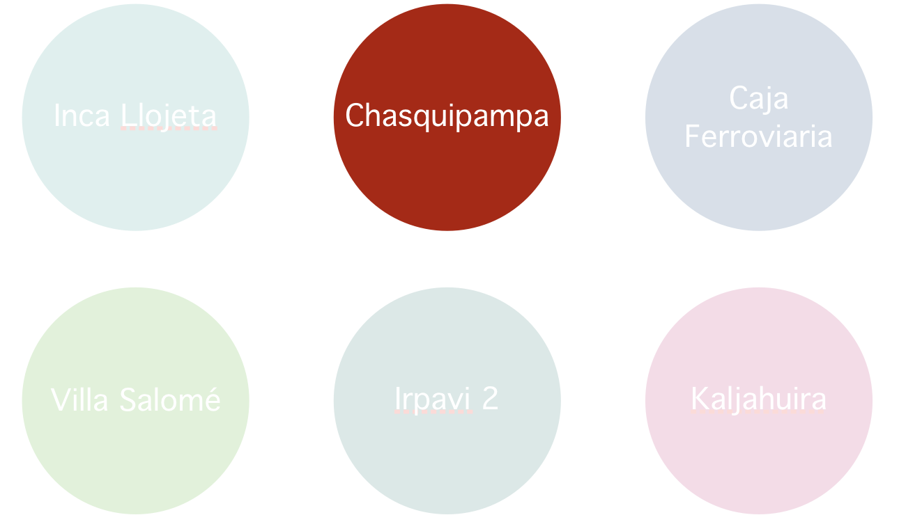
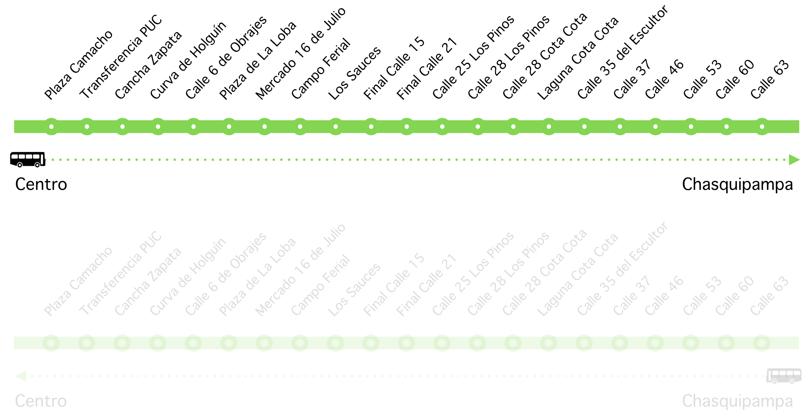
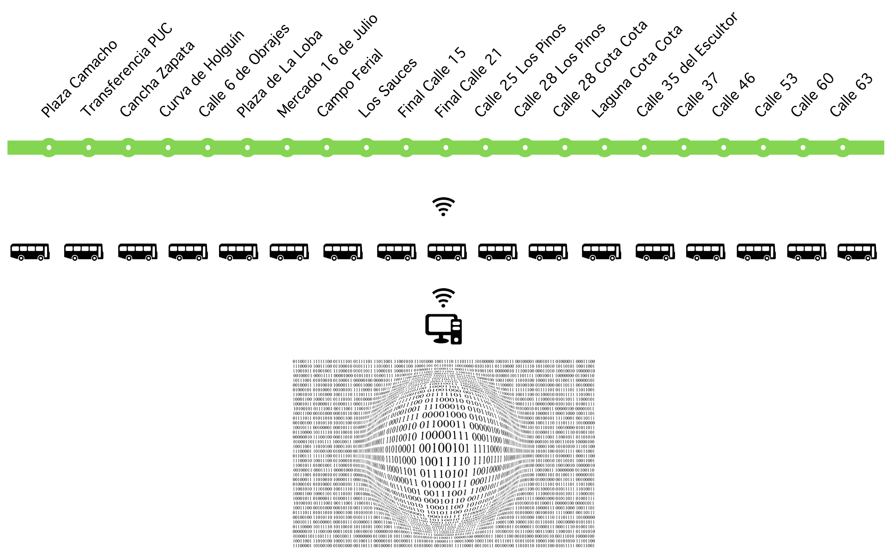
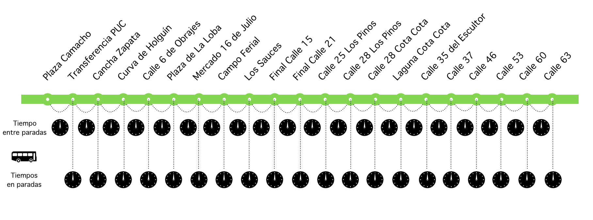
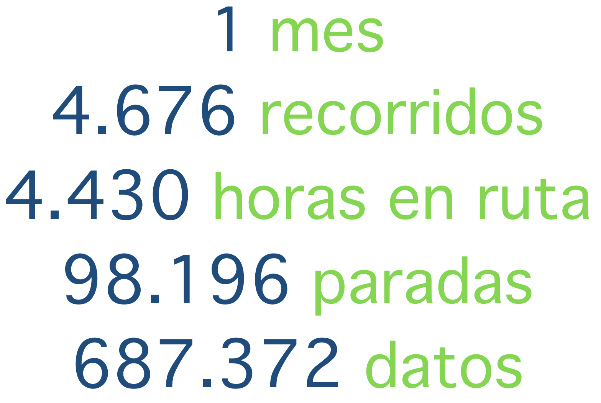
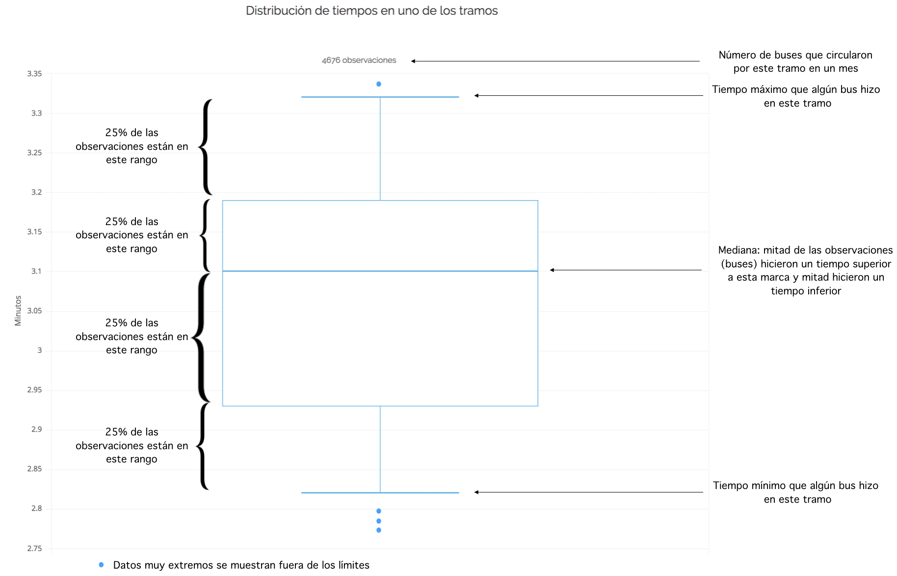
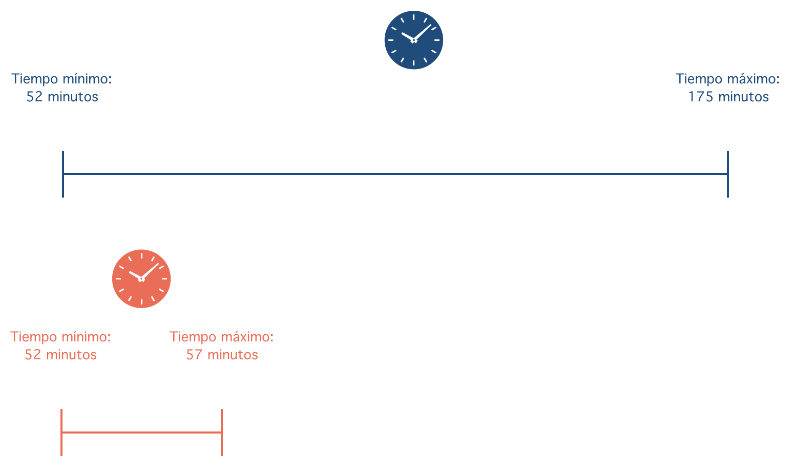
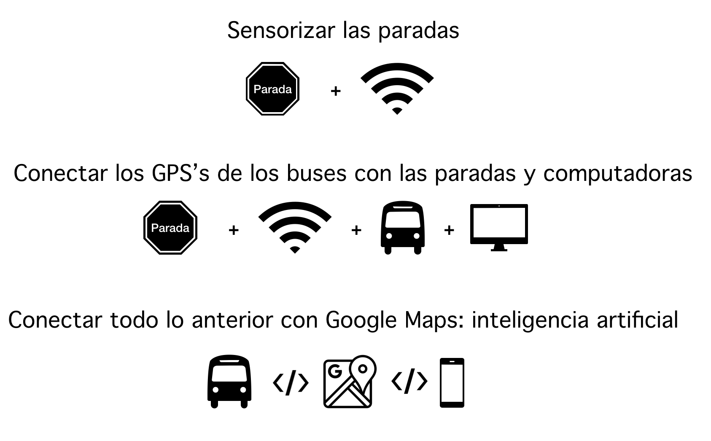

```{r, echo=F, warning=FALSE, error=FALSE, include=FALSE}
source("pumas.stats.R")
```

## 
<br>
<br>
<br>
<br>
<h2><center>Objetivo: Evaluar y mejorar el servicio de los Puma Katari con datos generados por los propios buses</center></h2>

## 
<br>
<br>
<br>
<br>
<br>
<h2><center>Sobre el proyecto</center></h2>

## Se eligió 1 de las 6 rutas
<br>
<br>


## Se eligió una dirección de la ruta
<br>
<br>


## Se supuso que los GPS de los buses generan datos


## Se tomaron los tiempos 5 veces (en condiciones normales)


## Estas condiciones pueden alterarse por:

- Paradas con mas gente que otras

- Tramos mas lentos que otros: tráfico vehicular

- Marchas y bloqueos en el centro de la ciudad 

- Horas que afectan los tiempos en los tramos (v.g. medio día vs. media noche)

- Los intervalos de partida se extrajeron de [aquí](http://www.lapazbus.bo/horarios/3/)

## 
<br>
<br>
<br>
<br>
<center><h2>Con todas estas características se simularon casi 700 mil datos en [R](https://www.r-project.org)</center></h2>


##
<iframe width="1200" height="650" src="https://www.youtube.com/embed/iAGTwDc71rk?rel=0&amp;controls=0&amp;showinfo=0;autoplay=1" frameborder="0" allowfullscreen></iframe>

##
<br>
<br>
<br>
<br>
<center><h2>La simulación generó </center></h2>

##
<br>
<br>


##
<br>
<br>
<br>
<br>
<center><h2>Resultados </center></h2>

## 
```{r, echo=FALSE}
b
```
<br>
<left><small> - 97% de los viajes  tardan entre 52 y 60 minutos desde la primera hasta la última parada </small></left>
<br>
<left><small> - Sin embargo, a veces los buses tardan hasta 175 minutos (casi 3 horas)</small></left>
<br>
<left><small> - Veamos que días y a que horas se producen los mayores atrasos</small></left>

## 
```{r, echo=FALSE, include=TRUE}
d
```
<br>
<left><small> - Los 4 picos muestran atrasos por protestas sociales  </small></left>
<br>
<left><small> - Hay una tendencia en los picos pequeños: mayores atrasos  alrededor de las 11 y 12 am y 8pm</small></left>
<br>
<left><small> - Pero.. en que tramos se producen los atrasos?</small></left>

##
```{r, echo=FALSE, include=TRUE}
f
```
<br>
<left><small> - Los tramos entre las paradas 1 y 4 son los menos regulares. Los atrasos se generan allí</small></left>
<br>
<left><small> - Veamos en detalle estos tramos, sabiendo que son los que generan los atrasos</small></left>
<br>

##
<br>
<br>
<br>
<br>
<center><h2>Para ver el atraso por tramos y horas utilicé "boxplots". Ver la siguiente explicación </center></h2>


##


##
```{r, echo=FALSE, include=TRUE}
h
```
<br>
<left><small>- El tramo 1-2 sufre los mayores atrasos entre las 7 y 9 am, entre las 12 y 14 pm y 19-20 pm </small></left>
<left><small>- El tramo 2-3 sufre los mayoes atrasos antre las 12 y 2 pm</small></left>
<left><small>- El tramo 3-4 sufre los mayoes atrasos antre las 7 y 8 de la mañana</small></left>
<left><small>- Veamos el mimso gráfico pero sin valores extremos</small></left>

##
```{r, echo=FALSE, include=TRUE, fig.height=1200}
i
```

##
<br>
<br>
<br>
<br>
<center><h2>Ahora veamos los tiempos en los tramos no conflictivos</center></h2>

##
```{r, echo=FALSE, include=TRUE}
j
```
<left><small>los mayores atrasos no se dan en estos tramos</small></left>
##
<br>
<br>
<br>
<br>
<center><h2>Resumen hasta aquí</center></h2>

##
<br>
<br>
<br>
<br>
<center><h2>Los atrasos se dan por conflcitos sociales y también por demoras en horas picos en los tramos 1 al 4 (centro) particularmente</center></h2>

## El objetivo es pasar del modelo azul al rojo: tiempo total del recorrido 


## 
<br>
<br>
<br>
<br>
<center><h2>Se sabe sobre que tramos y horas se debe actuar. Después, los datos nos dirán si las reformas son efectiuvas o no</center></h2>

## 
<br>
<br>
<br>
<br>
<center><h2>Propuesta</center></h2>

## 


## No se necesita mucho
<br>
<br>
<center><h2>Los datos de la simulación pesan 14 megabytes o **2% de un DVD**</center></h2>
<br>
<br>
<center><h2>Los datos para todas las rutas por año pesarían 19  gigabytes  o **4 DVD`s**</center></h2> 

## 

rafa lópez v

- [<i class="fa fa-github"></i> GitHub](https://github.com/rafalopezv).

- <a href="https://twitter.com/rafa_lopezv"><i class="fa fa-twitter"></i> @rafa_lopezv</a>

- <a href="mailto:lopezvalverde.rafael@gmail.com"><i class="fa fa-envelope"></i> lopezvalverde.rafael@gmail.com</a>

- <a href="https://www.facebook.com/profile.php?id=585845584"><i class="fa fa-facebook"></i> rafa</a>

